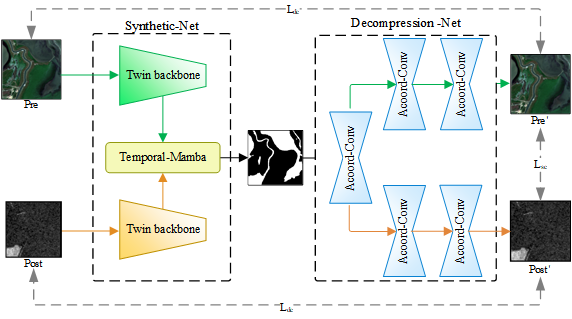
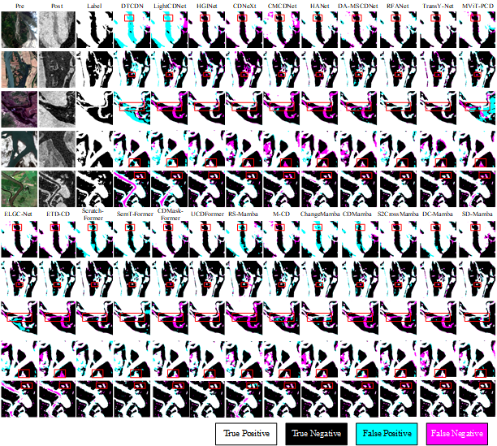
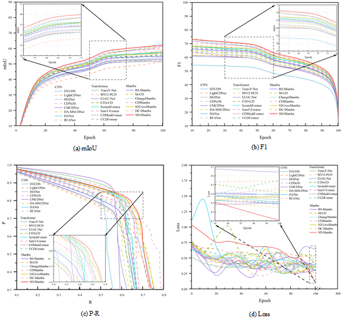

# 
` SD-Mamba: A lightweight synthetic-decompression network for cross-modal flood change detection`

> **Authors:**
Yu Shen; Shuang Yao; Zhenkai Qiang; Guanxiang Pei

### 1. Overview

Cross-modal flood change detection using optical and SAR images has become one of the most commonly used techniques for monitoring the progression of flooding events. Existing methods fail to adequately capture the interrelationship between semantics and changes, which limits the potential for effective flood detection. To address this issue, we propose a lightweight Synthetic-decompression network. The synthetic component is divided into four stages, each of which employs a Multi-branch Asymmetric Part-convolution block (MAPC) and a Temporal Semantic Interaction module (TSIM) to extract semantic features from dual-temporal images. Subsequently, these features are fed into the Temporal-mamba (T-Mamba), which uses 4D Selective Scanning (SS4D) to traverse temporal change information in four directions. The decompression component employs a three-stage Asymmetric Coordinate-convolution block (ACoord-Conv) to project the change results onto the source images, thereby indirectly supervising the model's detection performance. Compared to the 22 state-of-the-art (SOTA) lightweight methods, SD-Mamba achieves an optimal balance between computational efficiency and detection accuracy. Under the same computational conditions, SD-Mamba demonstrated superior performance to other Mamba-based models, with an improvement of 1.01% in mIoU, while maintaining a lightweight structure with only 5.32M parameters and 12.24G floating-point operations (FLops).

      

### 2. Usage
#### 2.1 Dataset
+ Prepare the data:
    Download the change detection datasets from the following links. Place them inside your `data` folder.

  - [`CAUFlood`](https://pan.baidu.com/s/1i5yxdfwjP-oTyiRmq6FZHQ)
  - [`Wuhan`](http://gpcv.whu.edu.cn/data/)

- Crop all datasets into 256x256 patches.

#### 2.2 Setting up conda environment
+ Prerequisites for Python:
    - Creating a virtual environment in terminal: `conda create -n SD-Mamba python=3.8`
    - Installing necessary packages: `pip install -r requirements.txt `

#### 2.3 tran & test & evaluation
+ Train/Test:
   - `train.py`
   - `test.py`
   - `evalution.py`

### 3. Change Detection Results

      
   Visualization results of SD-Mamba compared to 22 lightweight SOTA methods on the CAU-Flood dataset, the red boxes are drawn to highlight the advantages of SD-Mamba..

      
   Visualization results of SD-Mamba compared to 22 lightweight SOTA methods on the Wuhan dataset, the red boxes are drawn to highlight the advantages of SD-Mamba..

